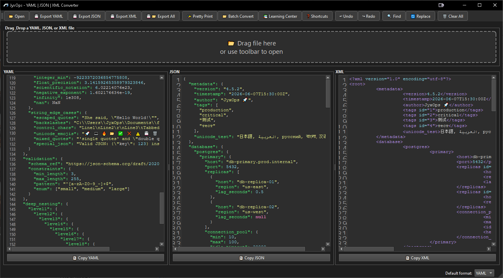
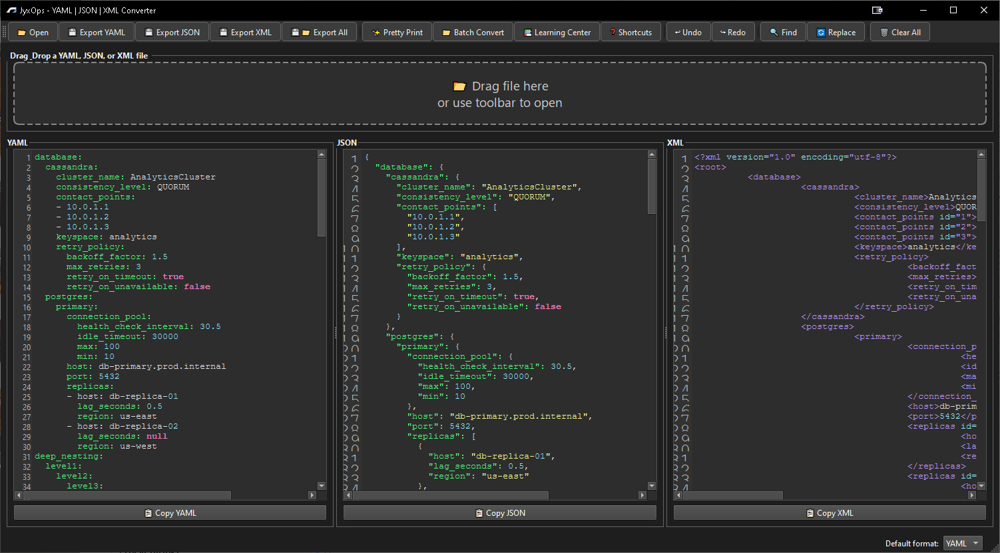
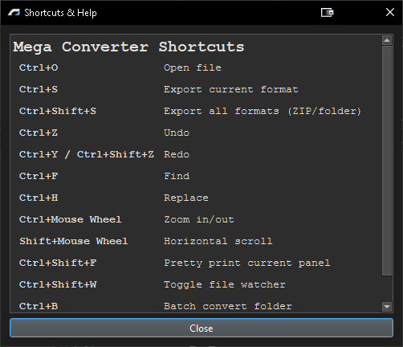
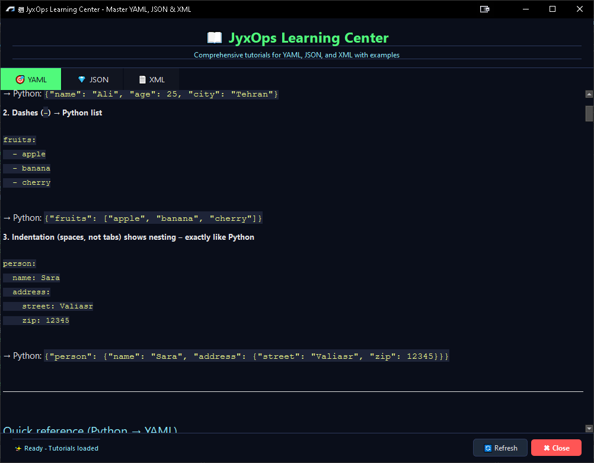
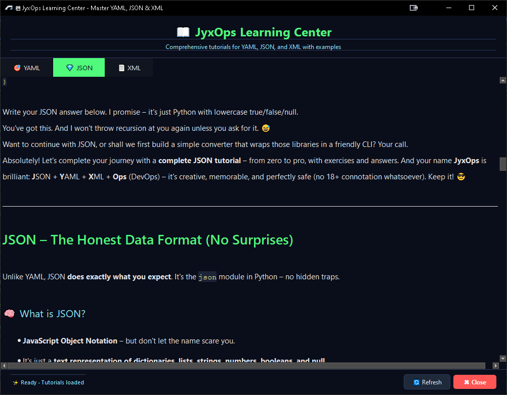
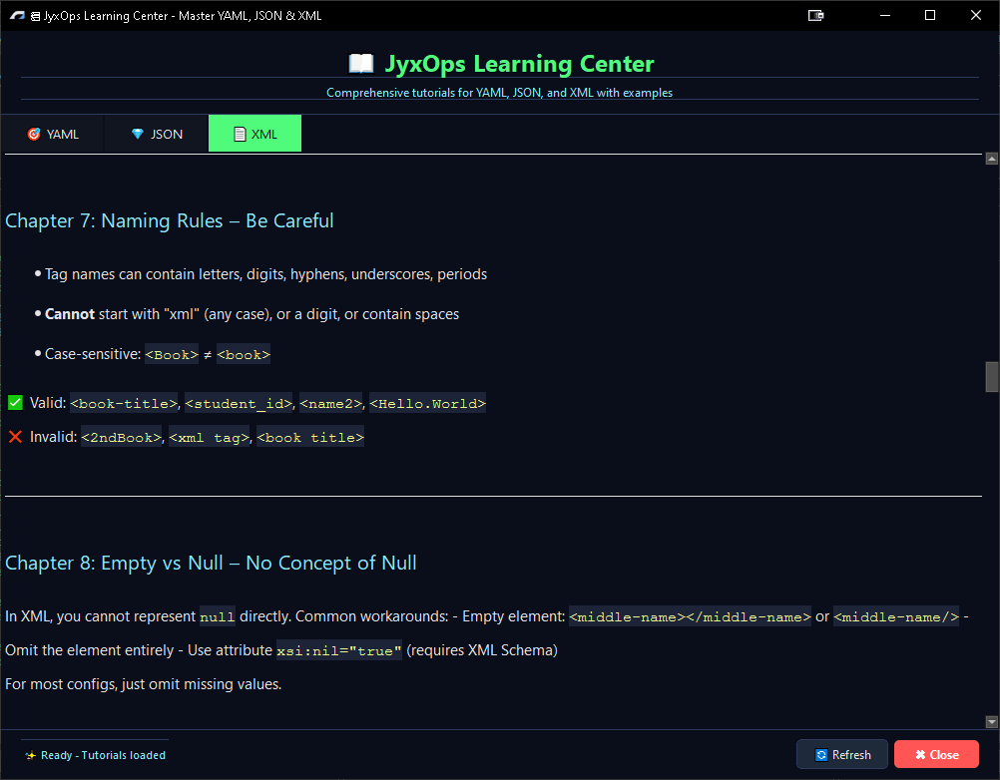
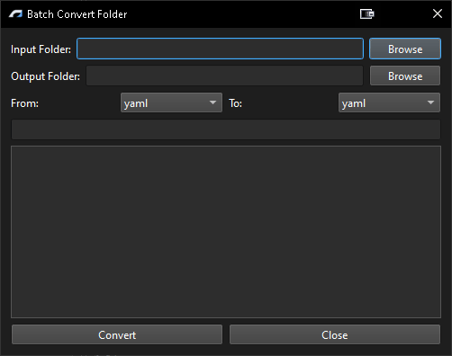
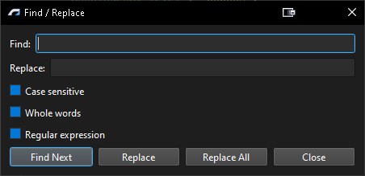

# JyxOps v2.0


> **YAML to JSON to XML converter. Three formats. One interface. Zero complexity.**

Convert between YAML, JSON, and XML in real time. Edit one format, watch the others update instantly. No cloud. No tracking. No subscription. Just a tool that does exactly what you need.


---

## What problem does this solve?

Every developer has been there. You have a YAML config file but the API expects JSON. You have XML data but your script needs YAML. You spend minutes manually converting formats, dealing with syntax differences, fixing indentation errors.

JyxOps solves this by giving you three editors in one window. Type in YAML, get JSON and XML automatically. Paste XML, get YAML and JSON immediately. The conversion happens as you type. No buttons to click. No waiting. No syntax errors to debug.

Built because existing converters were either online only, required uploading sensitive data, or had clunky interfaces that made the process slower than just doing it manually.

---

## What makes this different?

**Real time conversion.** Change a value in YAML and the JSON and XML panels update immediately. No refresh button. No delay. Just instant feedback.

**Works offline completely.** Your data never leaves your computer. There is no cloud component. There is no telemetry. The converter runs entirely locally.

**Three formats, one interface.** YAML on the left, JSON in the middle, XML on the right. Everything visible at once. No switching between tabs or windows.

**Learning center built in.** Not sure about YAML syntax? Open the learning center with Ctrl+L. Tutorials for all three formats are included, with examples and common mistakes explained.

**Dark theme by default.** Your eyes will thank you during late night coding sessions.

---

## Features

| Category | What is inside |
|----------|----------------|
| Core conversion | YAML to JSON, YAML to XML, JSON to YAML, JSON to XML, XML to YAML, XML to JSON. All conversions happen in real time. |
| Three editors | Each format has its own editor with syntax highlighting, line numbers, zoom in/out with Ctrl+mouse wheel, and horizontal scroll with Shift+mouse wheel. |
| File operations | Open YAML, JSON, or XML files. Export any format individually. Export all three formats at once as separate files or as a ZIP archive. |
| Pretty print | Clean up messy formatting with Ctrl+Shift+F. Works for all three formats. |
| Find and replace | Search within any editor. Replace text. Replace all occurrences. Supports case sensitivity and whole word matching. |
| Batch conversion | Convert entire folders from one format to another. Useful for migrating large collections of files. |
| Learning center | Separate window with tutorials for YAML, JSON, and XML. Access with Ctrl+L. Includes syntax guides, common mistakes, and practice exercises. |
| Undo and Redo | Standard Ctrl+Z and Ctrl+Y shortcuts work in all editors. |
| Copy to clipboard | One button copy for each format's content. |
| Drag and drop | Drop any YAML, JSON, or XML file onto the application to load it. |
| Persistent settings | Your font sizes, splitter positions, and default format preference are saved between sessions. |

---

## Screenshots

<table>
    <tr>
        <td>main window</td>
        <td>main window prettirt used</td>
    </tr>
    <tr>
        <td>shortcuts and help</td>
        <td>learning center yaml</td>
    </tr>
    <tr>
        <td>learning center json</td>
        <td>learning center xml</td>
    </tr>
    <tr>
        <td>batch converter folder</td>
        <td>find and replace</td>
    </tr>
</table>

---

## Getting Started

### Windows

Download `setup_and_run.bat` and double click it.

The script will check your Python version, create a virtual environment, install dependencies, and launch JyxOps. If something is missing, it tells you exactly what and where to get it.

```
setup_and_run.bat
```

If Windows Defender flags it, click "more info" then "run anyway". The script is readable. You can inspect every line before running.

### Mac / Linux

Download `setup_and_run.sh`, make it executable, and run it.

```bash
chmod +x setup_and_run.sh
./setup_and_run.sh
```

Same as the Windows version. It checks Python, sets up the environment, installs dependencies, and launches JyxOps.

### Manual setup

```bash
git clone https://github.com/mh3nj/jyxops.git
cd jyxops
python -m venv .venv

# Windows:
.venv\Scripts\activate
# Mac/Linux:
source .venv/bin/activate

pip install -r requirements.txt
python main.py
```

### Requirements

- Python 3.11 or higher
- 500 MB RAM is plenty
- Works fully offline after installation
- Internet only needed for installing dependencies

---

## First Run

When you launch JyxOps for the first time, you will see three empty editors. You can either:

1. Drag and drop a YAML, JSON, or XML file onto the drop area
2. Click the Open button in the toolbar
3. Start typing directly into any editor

The other two editors will populate automatically as you type. If you make a syntax error, the editor border turns red and the error message appears in the status bar.

Press Ctrl+L to open the Learning Center. It contains complete tutorials for all three formats with examples you can copy and paste directly into the editors.

---

## Keyboard Shortcuts

| Shortcut | Action |
|----------|--------|
| Ctrl+O | Open a file |
| Ctrl+S | Export current format |
| Ctrl+Shift+S | Export all formats (ZIP or folder) |
| Ctrl+Z | Undo |
| Ctrl+Y or Ctrl+Shift+Z | Redo |
| Ctrl+F | Find text |
| Ctrl+H | Replace text |
| Ctrl+Shift+F | Pretty print current editor |
| Ctrl+B | Batch convert folder |
| Ctrl+L | Open Learning Center |
| Ctrl+? | Show shortcuts dialog |
| Ctrl+mouse wheel | Zoom in/out |
| Shift+mouse wheel | Horizontal scroll |

---

## Project Structure

```
jyxops/
├── main.py                      # Application entry point
├── learning_center.py           # Tutorial window
├── indented_edit.py             # Editor widget with line numbers
├── highlighter.py               # Syntax highlighting
├── find_replace_dialog.py       # Find and replace UI
├── themes.py                    # Dark theme styling
├── settings_manager.py          # Persistent settings
├── about_dialog.py              # Shortcuts help dialog
├── batch_converter.py           # Batch conversion
├── requirements.txt             # Dependencies
├── setup_and_run.bat            # Windows launcher
├── setup_and_run.sh             # Mac/Linux launcher
├── resources/
│   ├── logo.png                 # Application logo
│   └── favicon/
│       └── favicon.ico          # Window icon
├── LearnHub/
│   ├── yaml.md                  # YAML tutorial
│   ├── json.md                  # JSON tutorial
│   └── xml.md                   # XML tutorial
└── screenshots/
    └── (images for readme)
```

---

## Dependencies

```
PyQt6>=6.6.0         # GUI framework
PyYAML>=6.0          # YAML parsing
xmltodict>=0.13.0    # XML to dict conversion
dicttoxml>=1.7.4     # Dict to XML conversion
pygments>=2.0.0      # Syntax highlighting for tutorials
markdown>=3.4.0      # Markdown to HTML for tutorials
```

No internet connection is required after installation. All conversions happen locally.

---

## Known Limitations

- Very large files (over 100 MB) may cause slow performance due to real time conversion
- XML with complex namespaces may lose namespace prefixes during conversion
- YAML anchors and aliases are resolved during conversion; they do not persist in the output
- The Learning Center tutorials are Markdown files; they can be edited or replaced with your own content

---

## Development Context

This project was built under internet restrictions in Iran, where access to GitHub, PyPI, Stack Overflow, and most development resources was blocked during extended periods. Dependencies were researched and downloaded during brief connectivity windows. Documentation was consulted from locally cached copies.

The application was built anyway. It works. It is documented. It can be cloned and run by anyone.

---

## About the Author

**Mohsen Jafari** is a full time web developer based in Iran, with experience in frontend development, backend systems, and desktop applications.

JyxOps was built to solve a real need: a converter that does not require uploading sensitive data to someone else's server, does not have a subscription fee, and works entirely offline.

- github: [github.com/mh3nj](https://github.com/mh3nj)
- xing: [xing.com/profile/Mohsen_Jafari093223](https://www.xing.com/profile/Mohsen_Jafari093223/)
- logo design: [parsegan.com](https://parsegan.com)
- portfolio: [dahgan.com](https://dahgan.com)

---

## License

MIT. Use it, fork it, modify it, ship it. Attribution is appreciated but not required.

---

## The Story Behind This

This project was built during a period when the internet in Iran was heavily restricted. No Stack Overflow. No PyPI. No GitHub. No YouTube tutorials. No reliable connection to the tools most developers take for granted. Just whatever was cached locally, whatever could be reasoned through from first principles, and the determination to ship something real.

It works. It is useful. It was built under conditions that would have stopped most projects before they started.

**JyxOps. YAML. JSON. XML. One tool. Your machine. Your control.**

— mh3nj
